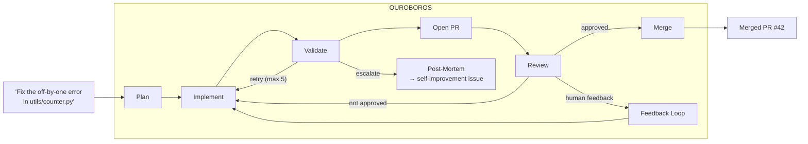
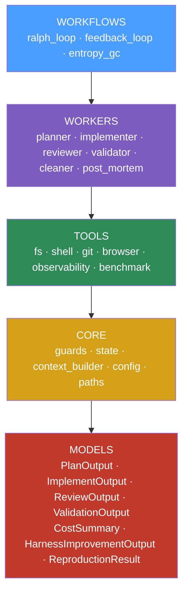
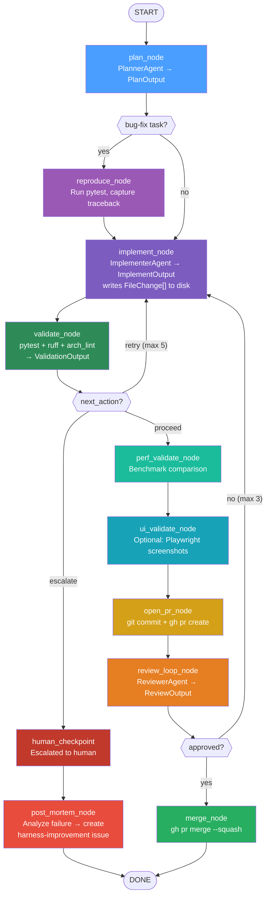
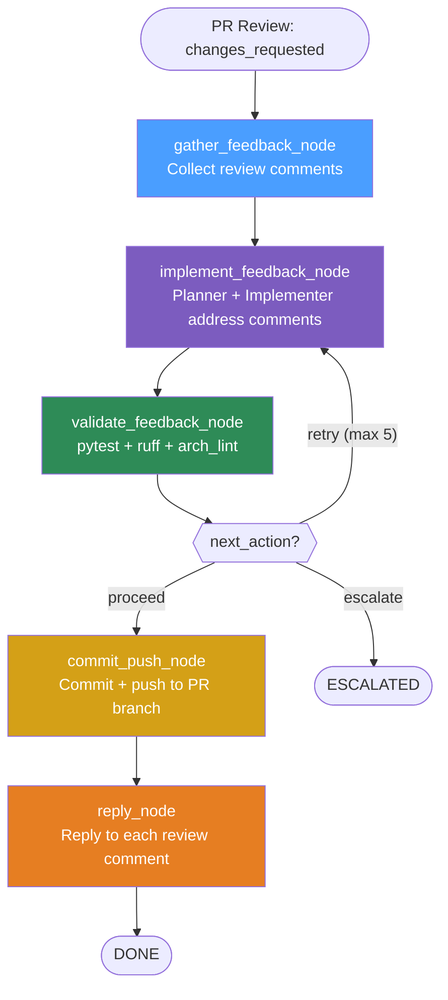
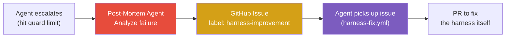
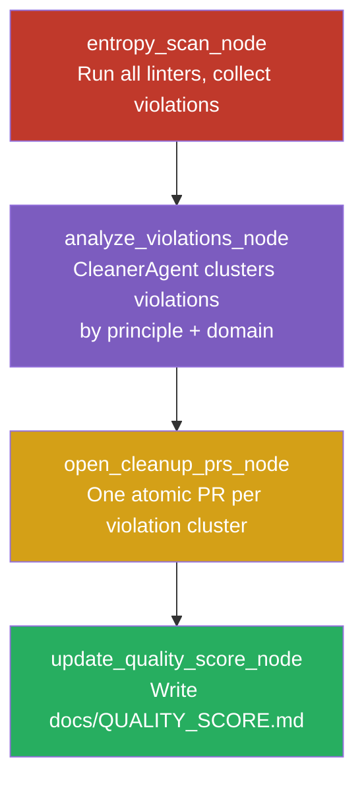
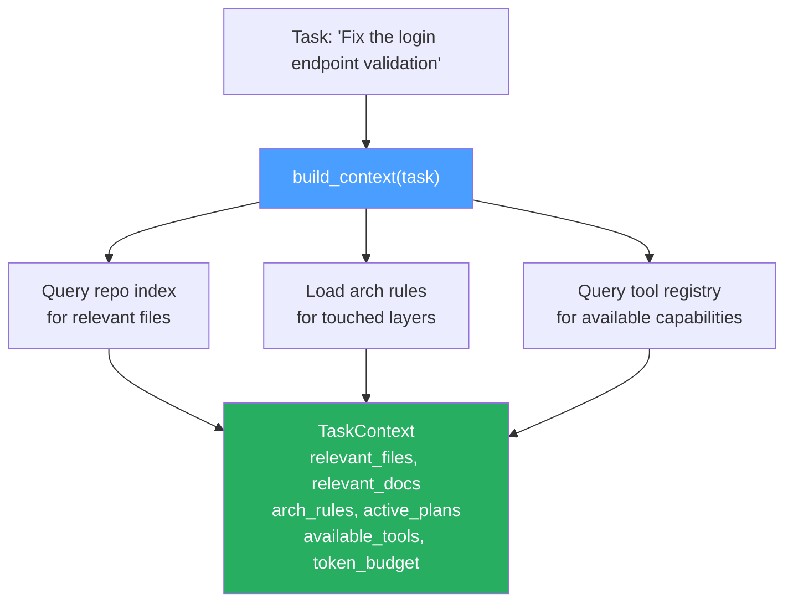
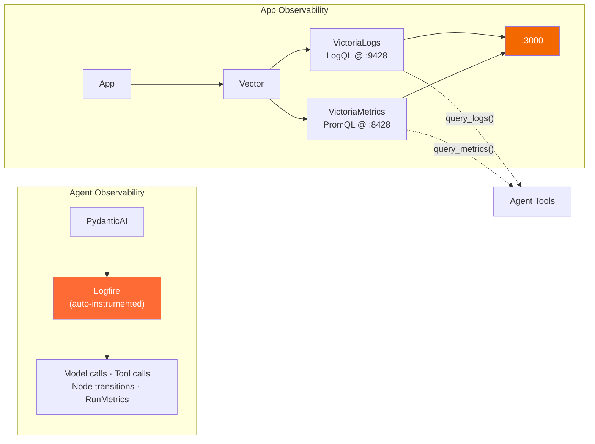
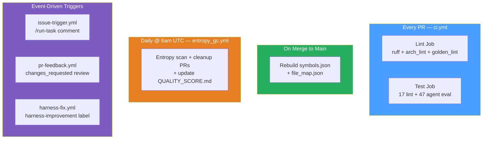

<p align="center">
  
  
  
  
  
  
  
</p>

<h1 align="center">Ouroboros</h1>
<h3 align="center">AI Agent Software Development Infrastructure</h3>

<p align="center">
  <em>The system that manages and improves itself.</em>
</p>

<p align="center">
  
</p>

---

Ouroboros is an agent-first software engineering system.

**Input:** natural language task | **Output:** merged pull request

Six specialized agents — planner, implementer, validator, reviewer, cleaner, post-mortem — plan, write, test, review, merge, and learn from failures autonomously inside a constrained architecture.

---

**Ouroboros** is an agent-first software factory. It takes a natural language task as input and produces a merged, tested, reviewed pull request as output. The agents collaborate through typed Pydantic contracts — no text parsing, no regex, no string matching at any boundary.

The system is self-referential: agents can be tasked to improve the agent infrastructure itself — better prompts, tighter lint rules, new tools — all flowing through the same PR review process.



### Quick Example

> **Task:** "Fix the off-by-one error in utils/counter.py"
>
> 1. **Planner** decomposes the task into typed execution steps
> 2. **Implementer** writes the patch, returns `FileChange[]`
> 3. **Validator** runs pytest + ruff + arch_lint — all pass
> 4. **PR opened** via `gh pr create`
> 5. **Reviewer** agent inspects the diff, approves
> 6. **PR merged** via `gh pr merge --squash`
>
> **Total cost:** $0.0087 | **Iterations:** 2 | **Time:** ~30s

---

### Current Status

> **Status: Testing**

| Done | Upcoming |
|------|----------|
| Core workflow (plan → implement → validate → review → merge) | Live agent integration tests with Vertex AI |
| Architecture linting with AGENT_REMEDIATION | Larger repo benchmarks |
| 10 Golden Principles with machine-checkable lint | Screenshot diff tool for UI validation |
| Repository index (189 symbols, 47 files) | Prompt tuning from Logfire trace data |
| Per-node token tracking and cost metrics | End-to-end Ralph Loop on real tasks |
| 284 tests passing (no GCP credentials required) | |
| Parallel sandbox execution via isolated git worktrees | |
| GitHub issue comment trigger (`/run-task`) | |
| PR feedback loop — agents address human review comments | |
| Struggle-driven self-improvement (post-mortem → auto-fix) | |
| Per-worktree app booting with isolated observability | |
| CLI interface (`ouroboros run`, `feedback`, `gc`, `status`) | |

---

## Table of Contents

- [Why This Project Exists](#why-this-project-exists)
- [Why Ouroboros?](#why-ouroboros)
- [Architecture Overview](#architecture-overview)
- [The Ralph Loop](#the-ralph-loop--pr-lifecycle-workflow)
- [Agent Workers](#agent-workers)
- [Typed Output Models](#typed-output-models)
- [Tool System](#tool-system)
- [Guard Rails](#guard-rails)
- [Cost Awareness](#cost-awareness)
- [PR Feedback Loop](#pr-feedback-loop)
- [Struggle-Driven Self-Improvement](#struggle-driven-self-improvement)
- [Entropy Management & GC](#entropy-management--garbage-collection)
- [Repository Index](#repository-index)
- [Context Builder](#context-builder)
- [Lint Framework](#lint-framework)
- [Observability](#observability)
- [Infrastructure & Sandboxing](#infrastructure--sandboxing)
- [Per-Worktree App Booting](#per-worktree-app-booting)
- [CLI](#cli)
- [Test Suite](#test-suite)
- [Core Beliefs](#core-beliefs)
- [Tech Stack](#tech-stack)
- [Repository Structure](#repository-structure)
- [Getting Started](#getting-started)
- [Configuration](#configuration)
- [CI/CD Pipelines](#cicd-pipelines)

---

## Why This Project Exists

Recent research suggests software engineering is shifting from *writing code* to *designing environments where agents write code*. The bottleneck moves from implementation speed to infrastructure quality — how well constrained, observable, and self-correcting the agent environment is.

Ouroboros explores what that environment looks like in practice:

- **Strict architectural constraints** — layered imports enforced by AST-based linting, not convention
- **Typed agent contracts** — every handoff is a Pydantic model, not a string to parse
- **Deterministic validation** — test/lint routing is a pure function, not an LLM guess
- **Automated entropy management** — daily GC workflow prevents codebase drift before it compounds
- **Cost as a first-class signal** — every run tracks tokens, dollars, and per-node breakdowns

The name is intentional: the system can be tasked to improve itself, and those improvements flow through the same constrained pipeline as any other change.

---

## Why Ouroboros?

Traditional software development is a loop: **plan → write → test → review → merge → repeat**. Ouroboros encodes this loop as a state machine where AI agents execute each step, with typed contracts at every boundary and hard limits to prevent runaway execution.

**Key design constraints:**

1. **No text parsing, ever.** Every agent output is a typed Pydantic model. No regex, no JSON extraction, no "parse the LLM response." If a handoff can fail silently, it will — so every handoff is a type.

2. **Guards are hard limits, not suggestions.** `MAX_IMPLEMENT_ITERATIONS = 5` is a constant, not a config value. An agent that loops forever is worse than one that escalates to a human.

3. **Token budgets are first-class.** The context builder enforces a token budget before agents see anything. Agents that read the whole repo are agents that fail on large repos.

4. **Entropy is tracked daily.** Ten machine-checkable Golden Principles (GP-001 to GP-010) are enforced by linters and a daily garbage collection workflow that opens atomic cleanup PRs.

5. **Self-improvement is the point.** Agents can write better agent workers, tighter lint rules, and new tools — all flowing through the same PR review process as any other change.

---

## Architecture Overview

Ouroboros uses a strict layered architecture enforced by AST-based linting. Each layer can only import from layers below it:



**Enforced invariants:**
- Workers **cannot** cross-import each other (shared logic goes to `core/` or `models/`)
- Tools **cannot** import workers (tools are stateless; workers orchestrate them)
- Models **cannot** import anything above them (pure types, zero side effects)

Violations are caught by `lint/arch_lint.py` with actionable `AGENT_REMEDIATION` messages so agents can self-fix.

---

## The Ralph Loop — PR Lifecycle Workflow

The Ralph Loop (`agents/workflows/ralph_loop.py`) is the main workflow. It takes a task string and produces a merged PR:



**Conditional routing** is driven entirely by typed model fields — no string matching:
- `ValidationOutput.next_action`: `"proceed"` | `"retry"` | `"escalate"`
- `ReviewOutput.approved`: `true` → merge, `false` → address feedback

**Entry point:**
```python
result = await run_ralph_loop("Fix the off-by-one error in utils/counter.py")
# result.status == "done"
# result.pr_url == "https://github.com/org/repo/pull/42"
# result.estimated_cost_usd == 0.012
```

---

## Agent Workers

Six specialized workers, each returning typed Pydantic models:

| Worker | Input | Output | Uses LLM? |
|--------|-------|--------|-----------|
| **Planner** | Task + TaskContext | `PlanOutput` (steps, risk, domains) | Yes |
| **Implementer** | Task + Plan + prior failures | `ImplementOutput` (FileChange[], commit msg) | Yes |
| **Reviewer** | PR diff + task context | `ReviewOutput` (approved, comments, blocking issues) | Yes |
| **Validator** | (runs tools directly) | `ValidationOutput` (test/lint results, next_action) | **No** |
| **Cleaner** | Scan report + domains | `CleanupOutput` (violations, quality scores, PR recs) | Yes |
| **Post-Mortem** | Task + error_log + iteration count | `HarnessImprovementOutput` (failure category, root cause, suggested fix) | Yes |

**The Validator is deliberately deterministic** — it runs `pytest` and lint tools, then calls a pure function (`determine_next_action()`) to decide the next step. No LLM call, no ambiguity.

Each LLM-based worker:
- Loads a system prompt from `agents/prompts/*.txt`
- Uses `get_model()` (Gemini 3.0 Flash via Vertex AI)
- Returns `(TypedOutput, TokenUsage)` for cost tracking
- Has `retries=3` for transient failures

---

## Typed Output Models

Every agent-to-agent handoff is a Pydantic model. Here are the key types:

```python
# Planning
class ExecutionStep(BaseModel):
    description: str
    files_affected: list[str]
    tool: Literal["fs", "shell", "git", "browser", "observability", "index"]
    expected_output: str

class PlanOutput(BaseModel):
    task_summary: str
    steps: list[ExecutionStep]
    risk_level: Literal["low", "medium", "high"]
    requires_human_review: bool
    requires_browser_validation: bool
    affected_domains: list[str]

# Implementation
class FileChange(BaseModel):
    path: str
    operation: Literal["create", "modify", "delete"]
    content: str | None
    diff_summary: str

class ImplementOutput(BaseModel):
    files_changed: list[FileChange]
    commit_message: str
    test_commands: list[str]

# Validation (drives routing)
class ValidationOutput(BaseModel):
    tests: TestResult
    lint: LintResult
    arch_lint: LintResult
    overall_pass: bool
    next_action: Literal["proceed", "retry", "escalate"]  # ← routing signal
    failure_summary: str

# Review (drives merge decision)
class ReviewOutput(BaseModel):
    approved: bool  # ← merge gate
    comments: list[ReviewComment]
    blocking_issues: list[str]
    summary: str
    arch_violations: list[str]
```

The `next_action` and `approved` fields are what drive LangGraph's conditional edges. Pure type routing — no string parsing.

---

## Tool System

All agent capabilities are registered in a `ToolRegistry` singleton. The planner queries `REGISTRY.all_tools()` before creating a plan, ensuring it can only reference tools that actually exist.

### Tool Catalog

| Category | Tool | Description |
|----------|------|-------------|
| **fs** | `read_file(path)` | Read a file from the repo |
| | `write_file(path, content)` | Write content, create parent dirs |
| | `list_dir(path)` | List directory contents |
| | `search_repo(query, pattern)` | Ripgrep search across repo |
| | `search_symbol(name)` | O(1) lookup in repo index |
| | `reindex(paths)` | Update symbol index for changed files |
| **shell** | `run_tests(path)` | Run pytest, return structured `TestResult` |
| | `run_lint(path)` | Run ruff + arch_lint + golden_lint |
| | `run_build()` | Build the application |
| | `run_command(cmd)` | Run arbitrary shell command |
| **git** | `git_status()` | Branch, changed, staged, untracked files |
| | `commit(message, files)` | Stage specific files and commit |
| | `open_pr(title, body)` | Create PR via `gh` CLI |
| | `get_pr_diff(pr_number)` | Fetch PR diff |
| | `get_pr_comments(pr_number)` | Fetch review comments |
| | `merge_pr(pr_number, strategy)` | Merge PR (squash/merge) |
| | `get_pr_metadata(pr_number)` | Fetch PR branch, title, body, labels |
| | `reply_to_pr_comment(pr_number, comment_id, body)` | Reply to a review comment |
| | `add_pr_label(pr_number, label)` | Add a label to a PR |
| | `push_to_remote(branch)` | Push branch to origin |
| | `create_issue(title, body, labels)` | Create a GitHub issue |
| **browser** | `take_screenshot(url)` | Playwright screenshot (base64 PNG) |
| | `snapshot_dom(url)` | Capture accessibility tree |
| | `drive_ui_flow(url, steps)` | Execute UI action sequence |
| **observability** | `query_logs(logql)` | Query VictoriaLogs (LogQL syntax) |
| | `query_metrics(promql)` | Query VictoriaMetrics (PromQL syntax) |

Every tool returns a **typed Pydantic model** — `TestResult`, `CommitResult`, `PRResult`, `ScreenshotResult`, etc. No raw strings.

```python
# Tool capability metadata — used by planner to understand what's available
class ToolCapability(BaseModel):
    name: str
    description: str
    input_schema: dict
    output_type: str
    category: Literal["fs", "shell", "git", "browser", "observability", "index"]
    requires_sandbox: bool
```

---

## Guard Rails

Hard limits enforced at the entry of every LangGraph node via `pre_node_guard()`. These are **constants, not config** — intentionally not tunable at runtime:

| Guard | Value | Scope | On Breach |
|-------|-------|-------|-----------|
| `MAX_IMPLEMENT_ITERATIONS` | **5** | implement → validate loops | escalate |
| `MAX_REVIEW_ITERATIONS` | **3** | review → fix loops | escalate |
| `MAX_TOOL_CALLS_PER_NODE` | **50** | tools per LangGraph node | abort |
| `MAX_TOTAL_TOOL_CALLS` | **200** | tools across entire run | abort |
| `MAX_COST_USD_PER_RUN` | **$2.00** | cost ceiling per workflow | escalate |

```python
def check_guards(state: RalphState) -> GuardResult:
    """Checked at every node entry. Returns allowed/escalate/abort."""
    if state.iteration_count >= MAX_IMPLEMENT_ITERATIONS:
        return GuardResult(allowed=False, action="escalate")
    if state.estimated_cost_usd >= state.cost_budget_usd:
        return GuardResult(allowed=False, action="escalate")
    ...
```

When an agent can't solve a problem within bounds, it **escalates to a human** rather than burning tokens indefinitely.

---

## Cost Awareness

Every workflow run tracks token usage and cost, producing a `RunMetrics` report:

```python
class TokenUsage(BaseModel):
    tokens_in: int
    tokens_out: int

    def cost_usd(self) -> float:
        """Gemini 3.0 Flash: $0.25/1M input, $1.50/1M output"""
        return (self.tokens_in * 0.25 + self.tokens_out * 1.50) / 1_000_000

class RunMetrics(BaseModel):
    cost: CostSummary
    per_node_costs: dict[str, CostSummary]  # Cost per LangGraph node
    highest_cost_node: str                   # Where most tokens were spent
```

**Example run breakdown:**

| Node | Input Tokens | Output Tokens | Cost USD |
|------|-------------|--------------|----------|
| plan_node | 2,100 | 800 | $0.0017 |
| implement_node | 4,500 | 2,200 | $0.0044 |
| validate_node | 0 | 0 | $0.0000 |
| review_node | 3,800 | 1,100 | $0.0026 |
| **TOTAL** | **10,400** | **4,100** | **$0.0087** |

Cost data flows to Logfire, building a dataset of cost-per-PR-by-task-type for regression tracking.

---

## PR Feedback Loop

When a human reviewer requests changes on an agent PR, the feedback loop workflow (`agents/workflows/feedback_loop.py`) autonomously addresses the comments:



**Triggers:**
- `pull_request_review` event with `changes_requested` action
- `/feedback` comment on an agent PR

**Safety:** Max 3 feedback iterations per PR (tracked via `feedback-iteration-N` labels). After 3 rounds, the agent escalates to a human.

```bash
# CLI usage
ouroboros feedback 42  # Address feedback on PR #42
```

---

## Struggle-Driven Self-Improvement

When the Ralph Loop escalates to a human (guard limits hit, repeated validation failures), the **post-mortem agent** analyzes the failure and creates a `harness-improvement` GitHub issue with a concrete fix suggestion:



The post-mortem agent categorizes failures into:
- `missing_tool` — agent needed a capability that doesn't exist
- `bad_prompt` — system prompt led to incorrect behavior
- `insufficient_context` — context builder didn't provide enough info
- `guard_limit` — legitimate task exceeded hard limits
- `validation_loop` — stuck in implement/validate cycle
- `external_dependency` — external service failure

Each category maps to a priority and a suggested fix targeting specific files in the harness.

---

## Entropy Management & Garbage Collection

Entropy is tracked as a first-class concern through ten **Golden Principles** — machine-checkable rules enforced by `lint/golden_lint.py` and a daily GC workflow:

| Principle | Rule | Severity | Auto-fixable |
|-----------|------|----------|-------------|
| **GP-001** | No duplicate utility functions across packages | error | Yes |
| **GP-002** | No file exceeds 500 lines | warning | No |
| **GP-003** | No hand-rolled helpers duplicating shared packages | warning | No |
| **GP-004** | All external data validated at boundary (Pydantic) | error | No |
| **GP-005** | No `print()` outside `scripts/` — use structured logging | info | Yes |
| **GP-006** | Schema types follow `*Output`/`*Result`/`*Schema` naming | info | No |
| **GP-007** | No dead imports | info | Yes |
| **GP-008** | All docs reference real code that still exists | warning | No |
| **GP-009** | Active exec-plans updated within 7 days | warning | No |
| **GP-010** | `QUALITY_SCORE.md` regenerated within 24 hours | info | Yes |

### Entropy GC Workflow

The entropy GC workflow (`agents/workflows/entropy_gc.py`) runs daily via GitHub Actions:



Each cleanup PR is:
- **Atomic** — one principle violation cluster per PR
- **Auto-mergeable** — if tests pass, no human required
- **Tiny** — <1 minute review time

---

## Repository Index

The repo index (`repo_index/`) provides O(1) symbol lookup so agents don't need to read every file:

```python
# Instead of reading 50 files to find a class:
@tool
def search_symbol(name: str) -> SymbolLocation | None:
    """Look up a symbol by name. Returns file + line."""
    # O(1) lookup in symbols.json
```

**Generated files:**
- `symbols.json` — Symbol name to file + line + kind (class, function, constant)
- `file_map.json` — File path to domain, layer, imports, exports

```json
// symbols.json (189 symbols indexed across 47 files)
{
  "ValidationOutput": {"file": "agents/models/validator.py", "line": 42, "kind": "class"},
  "run_planner":      {"file": "agents/workers/planner.py",  "line": 18, "kind": "async_function"}
}

// file_map.json
{
  "agents/workers/planner.py": {
    "domain": "agents",
    "layer": "workers",
    "imports": ["agents.models.planner", "agents.core.config"],
    "exports": ["run_planner"]
  }
}
```

The index is rebuilt automatically on every merge to `main` via CI, and agents can call `reindex()` after writing files.

---

## Context Builder

Agents never receive raw file dumps. The context builder (`agents/core/context_builder.py`) produces a token-budgeted context package:



The context builder is the **gatekeeper for token spend**. Without it, agents read 50 files and burn context on noise. With it, they receive exactly what they need within budget.

---

## Lint Framework

Four complementary linters work together to enforce code quality:

### Architecture Lint (`lint/arch_lint.py`)
AST-based layer dependency checker. Every violation includes an actionable remediation message:

```
ARCH-VIOLATION: agents/workers/planner.py imports from agents/workers/reviewer.py
RULE: Workers cannot cross-import. Extract shared logic to agents/core/.
REMEDIATION: Move shared type X to agents/models/shared.py and import from there.
DOCS: See ARCHITECTURE.md#worker-isolation
```

### Golden Lint (`lint/golden_lint.py`)
Enforces the 10 Golden Principles. Detection methods:
- **GP-001**: AST body comparison (`ast.unparse()`) across all functions
- **GP-002**: Line counting
- **GP-003**: Pattern matching (`while` + `sleep()` = hand-rolled retry)
- **GP-004**: `json.loads()` without `model_validate()` call
- **GP-005**: `print()` call detection outside allowed directories
- **GP-006**: BaseModel subclass suffix validation in `agents/models/`
- **GP-007**: Delegates to `ruff check --select F401`

### Doc Lint (`lint/doc_lint.py`)
Cross-references backtick paths in `.md` files against the repo index, ensuring documentation references real code that still exists.

### Rule Registry (`lint/rules.py`)
Centralized rule definitions with `AGENT_REMEDIATION` fields:
```python
@dataclass
class LintRule:
    id: str                  # "ARCH-001", "GP-005"
    name: str                # "worker-cross-import"
    description: str         # Human-readable
    severity: str            # "error", "warning", "info"
    agent_remediation: str   # Agent reads this to self-fix
    docs_link: str           # Reference to docs
    auto_fixable: bool       # Can agent fix without human?
```

---

## Observability

Two layers of observability — one for the agent system, one for the applications agents build:



Agents can query the observability stack to diagnose issues — the same way humans do:

```python
# Agent querying logs to diagnose an error
logs = await query_logs('{service="api"} |= "error"', duration="1h")

# Agent checking request latency
metrics = await query_metrics('rate(http_requests_total[5m])', duration="1h")
```

---

## Infrastructure & Sandboxing

### Observability Stack (`harness/observability/`)

```yaml
# docker-compose.yml
services:
  vector:              # Log/metric aggregation (port 8686)
  victoria-logs:       # LogQL log storage (port 9428, 7-day retention)
  victoria-metrics:    # PromQL metric storage (port 8428, 7-day retention)
  grafana:             # Dashboard (port 3000)
```

### Per-Worktree Sandbox (`harness/sandbox/`)

Each agent worktree gets an isolated Docker environment:

```bash
# Spin up isolated env for a task
scripts/worktree_up.sh feature-login 8100
# Creates git worktree at ../ouroboros-feature-login
# Starts sandbox containers on port 8100+

# Tear down when done
scripts/worktree_down.sh feature-login
```

Worktrees get isolated Docker networks (`ouroboros-{name}`), unique port allocations, and separate Vector instances forwarding to the main observability stack.

---

## Per-Worktree App Booting

Each isolated worktree can boot its own application and observability stack with automatically allocated ports. Port offsets are deterministically derived from the worktree name (`sha256(name) % 900 + 100`) to prevent collisions between parallel agent runs.

```bash
# Automatic port allocation from worktree name
scripts/worktree_up.sh feature-login
# App:             http://localhost:8247
# VictoriaLogs:    http://localhost:9547
# VictoriaMetrics: http://localhost:8647

# CLI with --with-app flag for full Docker lifecycle
ouroboros run --worktree --with-app "Fix the login form"
```

The `--with-app` flag in the CLI manages the full Docker lifecycle:
1. Creates git worktree with unique branch
2. Computes deterministic port offset
3. Sets `APP_URL`, `VICTORIA_LOGS_URL`, `VICTORIA_METRICS_URL` env vars
4. Starts Docker stack (`docker-compose.yml` + `docker-compose.worktree.yml`)
5. Runs the Ralph Loop with full observability
6. Tears down containers and worktree on completion

The observability tools (`query_logs()`, `query_metrics()`) read endpoint URLs from environment variables at call time (not import time), so each worktree's agent queries its own isolated stack.

---

## CLI

The `ouroboros` CLI (`agents/cli.py`) provides the primary interface for running agent workflows:

```bash
# Run the Ralph Loop on a task
ouroboros run "Add a /health endpoint that returns 200"

# Run in an isolated worktree with app booting
ouroboros run --worktree --with-app "Fix the login form"

# Address human review feedback on a PR
ouroboros feedback 42

# Run entropy GC (daily cleanup)
ouroboros gc

# Update quality scores only (no PRs)
ouroboros gc --scores-only

# List active agent worktrees
ouroboros status
```

| Command | Description |
|---------|-------------|
| `ouroboros run <task>` | Run the Ralph Loop — plan, implement, validate, review, merge |
| `ouroboros run --worktree <task>` | Run in an isolated git worktree |
| `ouroboros run --worktree --with-app <task>` | Run with full Docker app + observability |
| `ouroboros feedback <pr-number>` | Address review comments on an agent PR |
| `ouroboros gc` | Run entropy GC — scan, cleanup, open PRs |
| `ouroboros gc --scores-only` | Update quality scores without opening PRs |
| `ouroboros status` | List active ouroboros worktrees |

---

## Test Suite

64 tests organized into two categories, all runnable without GCP credentials or `pydantic_ai` installed:

### Lint Tests (`tests/lint/`)
| Test File | Tests | Coverage |
|-----------|-------|----------|
| `test_arch_lint.py` | 5 | Worker cross-import, tool→worker import, clean files, remediation messages |
| `test_golden_lint.py` | 12 | GP-001 through GP-006 (duplicates, file size, hand-rolled retry, validation, print, naming) |

### Agent Eval Tests (`tests/agent_eval/`)
| Test File | Tests | Coverage |
|-----------|-------|----------|
| `test_guards.py` | 6 | All guard types: iteration limits, tool budget, cost ceiling |
| `test_validator_logic.py` | 6 | `determine_next_action()` routing: proceed, retry, escalate |
| `test_bug_fix.py` | 5 | Model contracts for bug-fix workflow (PlanOutput, ImplementOutput, ValidationOutput) |
| `test_feature_gen.py` | 5 | Model contracts for feature generation (plan, implement, review) |
| `test_entropy_gc.py` | 8 | Entropy violation models, cleanup output, quality scoring, clustering |
| `test_workflow_routing.py` | 8 | Reproduce node routing, feedback loop guards, post-mortem triggering |
| `test_post_mortem.py` | 5 | Failure categorization, harness improvement output, issue creation |
| `test_feedback_loop.py` | 4 | Feedback state transitions, comment reply logic, iteration tracking |

**Design principle:** Deterministic logic (guards, validator routing, model contracts) is tested without an LLM. Probabilistic behavior (actual agent runs) uses mocks in CI and requires GCP credentials for integration testing.

```bash
# Run all tests
uv run pytest tests/ -v

# Run only lint tests
uv run pytest tests/lint/ -v

# Run only agent eval tests
uv run pytest tests/agent_eval/ -v
```

---

## Core Beliefs

Ten foundational principles that guide every design decision (from `docs/design-docs/core-beliefs.md`):

| # | Belief | Implication |
|---|--------|-------------|
| 1 | **Structure over text** | Pydantic models at every boundary |
| 2 | **Planner is not omniscient** | Must query `REGISTRY.all_tools()` before planning |
| 3 | **Token budget is first-class** | `build_context()` enforces limits |
| 4 | **Guards are not suggestions** | Hard constants, not runtime config |
| 5 | **Repo index is the map** | `search_symbol()` over `read_file()` |
| 6 | **Entropy accumulates** | Daily GC workflow prevents compounding |
| 7 | **Every run has a cost** | `CostSummary` tracks regression |
| 8 | **Self-referential loop is the feature** | Agents improve agents, through PR review |
| 9 | **Observability is a tool** | Agents query `query_logs()` / `query_metrics()` |
| 10 | **Small, atomic, reversible** | 10 small PRs > 1 large PR |

---

## Tech Stack

| Layer | Tool | Why |
|-------|------|-----|
| **Language Model** | Gemini 3.0 Flash via Vertex AI | Production-grade rate limits, IAM auth, regional isolation |
| **Agent Framework** | PydanticAI | Typed structured outputs, native Logfire tracing |
| **Orchestration** | LangGraph | Explicit state machine, conditional routing, human escalation |
| **Tracing** | Logfire | First-class PydanticAI instrumentation, OTel native |
| **Language** | Python 3.12+ | |
| **Package Manager** | uv | Fast, lockfile-based dependency resolution |
| **Linter/Formatter** | ruff | Covers isort + flake8 + pyupgrade + more |
| **Tests** | pytest + pytest-asyncio | Async-native test runner |
| **Git Automation** | gh CLI | Programmatic PR create/review/merge |
| **Browser** | Playwright | DOM snapshots + screenshots for UI validation |
| **Log Storage** | VictoriaLogs | LogQL-compatible, queryable by agents |
| **Metric Storage** | VictoriaMetrics | PromQL-compatible, queryable by agents |
| **Log Routing** | Vector | Routes app logs/metrics to storage |
| **Dashboards** | Grafana | Human-facing visualization |
| **CI** | GitHub Actions | Lint + tests on every PR, entropy GC daily |
| **Build** | hatchling | PEP 517 build backend |

---

## Repository Structure

```
ouroboros/
├── AGENTS.md                        # Agent entry point (read first)
├── ARCHITECTURE.md                  # Layer dependency rules
├── README.md                        # This file
│
├── agents/
│   ├── core/
│   │   ├── config.py                # Vertex AI + Gemini model init
│   │   ├── state.py                 # RalphState + FeedbackState TypedDicts
│   │   ├── guards.py                # Hard iteration/cost limits
│   │   ├── context_builder.py       # build_context() → TaskContext
│   │   ├── paths.py                 # repo_root() utility
│   │   └── instrumentation.py       # Logfire setup
│   │
│   ├── models/                      # Pure Pydantic output types
│   │   ├── planner.py               # PlanOutput, ExecutionStep
│   │   ├── implementer.py           # ImplementOutput, FileChange
│   │   ├── reviewer.py              # ReviewOutput, ReviewComment
│   │   ├── validator.py             # ValidationOutput, TestResult, LintResult
│   │   ├── cleaner.py               # CleanupOutput, EntropyViolation
│   │   ├── cost.py                  # TokenUsage, CostSummary, RunMetrics
│   │   ├── registry.py              # ToolCapability, ToolRegistry
│   │   ├── post_mortem.py           # HarnessImprovementOutput, FailureCategory
│   │   └── reproducer.py            # ReproductionResult, ErrorContext
│   │
│   ├── workers/                     # PydanticAI agent implementations
│   │   ├── planner.py               # run_planner() → (PlanOutput, TokenUsage)
│   │   ├── implementer.py           # run_implementer() → (ImplementOutput, TokenUsage)
│   │   ├── reviewer.py              # run_reviewer() → (ReviewOutput, TokenUsage)
│   │   ├── validator.py             # run_validator() → ValidationOutput (no LLM)
│   │   ├── cleaner.py               # run_cleaner() → (CleanupOutput, TokenUsage)
│   │   └── post_mortem.py           # run_post_mortem() → (HarnessImprovementOutput, TokenUsage)
│   │
│   ├── tools/                       # @tool functions + registry
│   │   ├── registry.py              # REGISTRY singleton, all tools registered
│   │   ├── fs.py                    # read_file, write_file, search_symbol
│   │   ├── shell.py                 # run_tests, run_lint, run_build
│   │   ├── git.py                   # git_status, commit, open_pr, merge_pr, get_pr_metadata, create_issue
│   │   ├── browser.py               # take_screenshot, snapshot_dom
│   │   ├── observability.py         # query_logs, query_metrics
│   │   └── benchmark.py             # run_benchmark, compare_benchmarks
│   │
│   ├── workflows/                   # LangGraph state machines
│   │   ├── ralph_loop.py            # Main PR lifecycle workflow
│   │   ├── feedback_loop.py         # PR feedback loop workflow
│   │   ├── post_mortem.py           # Struggle-driven self-improvement node
│   │   ├── reviewer_loop.py         # Agent-to-agent review
│   │   └── entropy_gc.py            # Daily entropy scan + cleanup PRs
│   │
│   ├── prompts/                     # System prompt .txt files
│   │   ├── planner.txt
│   │   ├── implementer.txt
│   │   ├── reviewer.txt
│   │   ├── cleaner.txt
│   │   └── post_mortem.txt
│   │
│   └── cli.py                       # ouroboros CLI (run, feedback, gc, status)
│
├── lint/
│   ├── arch_lint.py                 # AST-based layer dependency checker
│   ├── golden_lint.py               # GP-001 through GP-010 enforcement
│   ├── doc_lint.py                  # Stale doc reference detection
│   ├── rules.py                     # Named rules with AGENT_REMEDIATION
│   └── run_lint.py                  # CLI runner
│
├── repo_index/
│   ├── build_index.py               # Generates symbols.json + file_map.json
│   ├── symbols.json                 # Symbol → file + line + kind
│   └── file_map.json                # File → domain, layer, imports, exports
│
├── tests/
│   ├── lint/                        # Linter unit tests
│   │   ├── test_arch_lint.py
│   │   └── test_golden_lint.py
│   └── agent_eval/                  # Agent behavior tests
│       ├── test_guards.py
│       ├── test_validator_logic.py
│       ├── test_bug_fix.py
│       ├── test_feature_gen.py
│       ├── test_entropy_gc.py
│       ├── test_workflow_routing.py
│       ├── test_post_mortem.py
│       └── test_feedback_loop.py
│
├── harness/
│   ├── observability/
│   │   └── docker-compose.yml       # VictoriaLogs + VictoriaMetrics + Grafana
│   └── sandbox/
│       ├── docker-compose.yml       # Per-worktree app isolation
│       └── docker-compose.worktree.yml  # Per-worktree observability override
│
├── scripts/
│   ├── worktree_up.sh               # Spin up isolated worktree env
│   └── worktree_down.sh             # Tear down worktree + containers
│
├── docs/
│   ├── DESIGN.md                    # System design decisions
│   ├── GOLDEN_PRINCIPLES.md         # GP-001 through GP-010
│   ├── QUALITY_SCORE.md             # Auto-updated domain quality grades
│   ├── PLANS.md                     # How to read/write exec plans
│   └── design-docs/
│       └── core-beliefs.md          # 10 foundational principles
│
├── .github/workflows/
│   ├── ci.yml                       # Lint + tests on every PR
│   ├── entropy_gc.yml               # Daily entropy scan (6am UTC)
│   ├── issue-trigger.yml            # /run-task comment → agent run
│   ├── run-task.yml                 # Reusable workflow for task execution
│   ├── pr-feedback.yml              # PR review → feedback loop
│   └── harness-fix.yml              # harness-improvement → auto-fix
│
└── pyproject.toml                   # uv + ruff + pytest config
```

---

## Getting Started

### Prerequisites

- Python 3.12+
- [uv](https://docs.astral.sh/uv/) (package manager)
- [gh](https://cli.github.com/) (GitHub CLI, for PR operations)
- Docker + Docker Compose (for observability stack)
- Google Cloud project with Vertex AI enabled (for real agent runs)

### Installation

```bash
# Clone the repository
git clone https://github.com/Tanush1912/ouroboros.git
cd ouroboros

# Install all dependencies
uv sync --all-extras

# Build the repo index
uv run python repo_index/build_index.py

# Run tests to verify everything works
uv run pytest tests/ -v
```

### Running the Agent System

```bash
# Set required environment variables
export GCP_PROJECT="your-gcp-project-id"
export GCP_LOCATION="us-central1"        # optional, default
export LOGFIRE_TOKEN="your-logfire-token" # optional, for tracing

# Run a task through the Ralph Loop (CLI)
ouroboros run "Add a /health endpoint that returns 200"

# Run in an isolated worktree
ouroboros run --worktree "Fix the login form validation"

# Run with full app + observability stack
ouroboros run --worktree --with-app "Fix the login form"

# Address review feedback on a PR
ouroboros feedback 42

# Run entropy GC
ouroboros gc

# List active agent worktrees
ouroboros status
```

Or programmatically:

```bash
uv run python -c "
import asyncio
from agents.workflows.ralph_loop import run_ralph_loop
result = asyncio.run(run_ralph_loop('Add a /health endpoint that returns 200'))
print(f'Status: {result[\"status\"]}')
print(f'PR: {result[\"pr_url\"]}')
print(f'Cost: \${result[\"estimated_cost_usd\"]:.4f}')
"
```

### Running the Observability Stack

```bash
# Start the monitoring stack
cd harness/observability
docker compose up -d

# Grafana at http://localhost:3000 (admin/admin)
# VictoriaLogs API at http://localhost:9428
# VictoriaMetrics API at http://localhost:8428
```

### Running Linters

```bash
# Run all linters
uv run python lint/run_lint.py .

# Architecture lint only
uv run python lint/run_lint.py --arch-only .

# Golden principles lint only
uv run python lint/run_lint.py --golden-only .

# Ruff
uv run ruff check .
uv run ruff format --check .
```

---

## Configuration

### Environment Variables

| Variable | Required | Default | Description |
|----------|----------|---------|-------------|
| `GCP_PROJECT` | Yes (for agent runs) | — | Google Cloud project ID |
| `GCP_LOCATION` | No | `us-central1` | Vertex AI region |
| `OUROBOROS_MODEL` | No | `gemini-3.0-flash-preview` | Model name |
| `LOGFIRE_TOKEN` | No | — | Logfire API token for tracing |
| `GITHUB_TOKEN` | No | — | GitHub CLI auth (for PR operations) |
| `VICTORIA_LOGS_URL` | No | `http://localhost:9428` | VictoriaLogs endpoint |
| `VICTORIA_METRICS_URL` | No | `http://localhost:8428` | VictoriaMetrics endpoint |
| `APP_URL` | No | — | Application URL for browser validation |
| `WORKTREE_NAME` | No | — | Current worktree name (set by CLI/scripts) |
| `APP_PORT` | No | `8000` | Application port (offset for worktrees) |
| `VICTORIA_LOGS_PORT` | No | `9428` | VictoriaLogs port (offset for worktrees) |
| `VICTORIA_METRICS_PORT` | No | `8428` | VictoriaMetrics port (offset for worktrees) |

### Key Configuration Files

| File | Purpose |
|------|---------|
| `pyproject.toml` | Dependencies, ruff config, pytest config |
| `agents/prompts/*.txt` | System prompts (edit to tune agent behavior) |
| `docs/GOLDEN_PRINCIPLES.md` | Quality rules (add new principles here) |
| `lint/rules.py` | Rule definitions with remediation messages |

---

## CI/CD Pipelines



---

<p align="center">
  <strong>Ouroboros</strong> — the serpent that eats its own tail.<br/>
  A system that builds, reviews, and improves itself.
</p>
